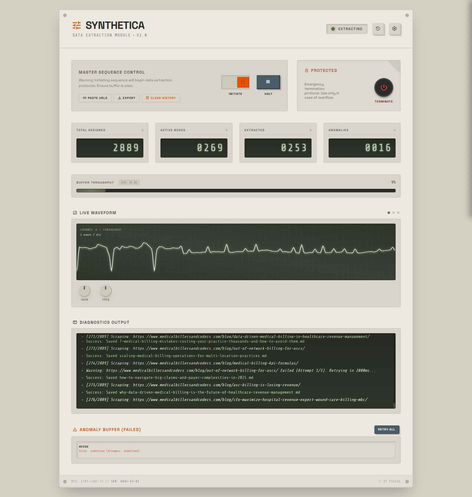

# Synthetica Blog Scraper



**Synthetica** is a high-performance, autonomous web scraper designed for bulk article extraction. Built with **Node.js**, **Puppeteer**, and a retro-futuristic web interface, it converts lists of URLs from CSV files into beautifully formatted Markdown articles while providing real-time monitoring, adaptive concurrency control, and intelligent error recovery.

---

## Table of Contents

- [Features](#features)
- [Project Structure](#project-structure)
- [Architecture](#architecture)
- [Prerequisites & Installation](#prerequisites--installation)
- [Quick Start Guide](#quick-start-guide)
- [Usage Guide](#usage-guide)
- [Configuration Reference](#configuration-reference)
- [REST API Documentation](#rest-api-documentation)
- [Socket.IO Events](#socketio-events)
- [Error Handling & Recovery](#error-handling--recovery)
- [Development Notes](#development-notes)
- [Troubleshooting](#troubleshooting)
- [Future Roadmap](#future-roadmap)

---

## Features

### 🎯 Core Functionality
- **Bulk URL Processing** - Import URLs via CSV files or manual paste
- **Autonomous Extraction** - Reads article bodies using Mozilla's Readability algorithm
- **HTML-to-Markdown Conversion** - Uses TurndownService for clean, semantic Markdown output
- **Stealth Browsing** - Puppeteer-Extra with StealthPlugin bypasses basic bot detection
- **Connection Pooling** - Pre-launches headless Chrome instances for optimal resource usage

### 🎛️ Control & Monitoring
- **Analog Control Deck UI** - Retro-futuristic dashboard with real-time monitoring
- **Live Log Feed** - System events streamed via Socket.IO with syntax highlighting
- **Progress Visualization** - Dynamic progress bar, ETA calculation, and success/failure tracking
- **Waveform Display** - Visual feedback indicator for scraping velocity

### 🛡️ Reliability
- **Adaptive Concurrency** - Auto-detects `HTTP 429` throttling and adjusts worker threads dynamically
- **Smart Retry Logic** - Exponential backoff with configurable retry limits
- **Anomaly Buffer** - Tracks failed URLs with error details for one-click re-queueing
- **Duplicate Prevention** - Persistent history (`processed_urls.json`) prevents re-scraping
- **Pause & Resume** - Gracefully pause active workers, resume at any time

### ⚙️ Customization
- **Dynamic Configuration** - Update settings in real-time via the Settings Drawer
- **Flexible Output Naming** - Choose filename convention: title slug, URL, or timestamp
- **Image Stripping** - Optional removal of `` tags from Markdown
- **Configurable Directories** - Specify custom CSV intake and Markdown output folders
- **Timeout Control** - Adjust page load timeout per session

---

## Project Structure

```
blog_scraper/
├── config.js                 # Configuration management (load/save/update)
├── server.js                 # Express.js server, REST API, Socket.IO hub
├── scraper.js                # Core scraping logic, Puppeteer orchestration
├── settings.json             # Persistent configuration file
├── package.json              # Node.js dependencies
├── processed_urls.json       # History of successfully scraped URLs
├── failed_urls.json          # Failed URL tracker with error details
├── public/
│   ├── index.html            # Main UI (Tailwind CSS + retro design)
│   ├── script.js             # Client-side state, Socket.IO listeners, DOM manipulation
│   └── style.css             # Custom CSS overrides
├── csv/                      # Input folder for CSV files
├── output/                   # Output folder for extracted Markdown files
└── screenshot.jpg            # Dashboard screenshot for documentation
```

---

## Architecture

### System Flow

```
[User Input] ──→ [CSV/Paste URLs] ─────────┐
                                           ├──→ [URL Queue] ──→ [Scraper]
                        [UI - Control Deck]│                     ├─→ [Readability]
                                           └─→ [Settings Dialog]└─→ [TurndownService]
                                                                     ├─→ [output/*.md]
                                                                     └─→ [failed_urls.json]
```

### Component Breakdown

#### **Backend (Node.js)**

| File | Responsibility |
|------|---|
| `server.js` | RESTful API server, WebSocket hub, CSV parsing, middleware setup |
| `scraper.js` | Puppeteer orchestration, page pooling, content extraction pipeline |
| `config.js` | Settings I/O (JSON persistence) and validation |

#### **Frontend (Browser)**

| File | Responsibility |
|------|---|
| `index.html` | Semantic markup, Tailwind CSS grid layout |
| `script.js` | Socket.IO client, event handlers, real-time UI updates, modals |
| `style.css` | Custom animations, retro-futuristic design tokens |

---

## Prerequisites & Installation

### System Requirements

- **Node.js** v18+ (v20 LTS recommended)
- **NPM** v9+ (included with Node.js)
- **Disk Space** - ~500MB for Chromium + node_modules
- **RAM** - Minimum 2GB (4GB+ recommended for concurrency > 5)
- **OS** - Windows, macOS, or Linux

### Step-by-Step Installation

#### 1. Clone the Repository
```bash
git clone https://github.com/yourusername/blog_scraper.git
cd blog_scraper
```

#### 2. Install Dependencies
```bash
npm install
```

This installs:
- **puppeteer** - Headless Chrome automation
- **puppeteer-extra + stealth plugin** - Bot detection bypass
- **express** - Web server framework
- **socket.io** - Real-time bidirectional communication
- **csv-parser** - CSV file parsing
- **@mozilla/readability** - Article content extraction
- **turndown** - HTML-to-Markdown conversion
- **jsdom** - DOM simulation for Readability
- **slugify** - URL-safe filename generation
- **multer** - File upload handling

---

## Quick Start Guide

### Running the Application

```bash
# Start the server
node server.js

# Output:
# Server running on http://localhost:3000
# Listening for WebSocket connections...
```

Then open **http://localhost:3000** in your browser.

### First Run Checklist

1. ✅ Ensure `csv/` folder exists (auto-created if missing)
2. ✅ Check that `settings.json` was generated with defaults
3. ✅ Verify browser opens to the Control Deck UI
4. ✅ Test connectivity: the status LED should show "System Ready"

---

## Usage Guide

### Method 1: CSV File Import (Bulk Scraping)

**Prepare Your CSV:**
```csv
url
https://example.com/article-1
https://example.com/article-2
https://example.com/article-3
```

**Two Import Options:**

**Option A - Folder Drop**
1. Place the CSV file directly into the `csv/` folder in your project directory
2. The system polls for new files every 3 seconds

**Option B - Drag & Drop**
1. Drag and drop the CSV file directly onto the web dashboard
2. The file is uploaded and queued immediately

**Start Scraping:**
1. Click the glowing **Initiate** toggle switch
2. Watch the real-time log feed and progress bar
3. Extracted Markdown files appear in the `output/` folder as they complete

### Method 2: Manual URL Entry

**Steps:**

1. Click the **Paste URLs** button (📎 icon) in the top toolbar
2. A modal dialog appears
3. Paste your URLs (one per line):
   ```
   https://example.com/article-1
   https://blog.site.com/post-title
   https://news.org/story-123
   ```
4. Click **Load URLs** to queue them
5. Click the **Initiate** toggle to begin extraction

### Monitoring Progress

The Control Deck displays in real-time:

| Element | Shows |
|---------|-------|
| **Status LED** | Green = Ready, Red = Error, Blue = Active |
| **Progress Bar** | Percentage of URLs processed |
| **Waveform Display** | Extraction velocity indicator |
| **Log Window** | Timestamped system events and errors |
| **Statistics Panel** | Total, current, successful, and failed URLs |
| **ETA Counter** | Estimated time remaining |

### Pausing & Resuming

- **Pause**: Click the **Pause** button or press `Spacebar`. Active workers finish their current URL, then halt.
- **Resume**: Click **Resume** button to continue the queue
- **Terminate**: Click **Terminate** (red button) for emergency shutdown

---

## Configuration Reference

Click the **Settings** icon (⚙️) in the top-right corner to access the Configuration Drawer.

### Configuration Options

| Setting | Type | Default | Description |
|---------|------|---------|---|
| **Concurrency** | Integer | 5 | Number of parallel headless browser tabs. **Recommendation**: Start at 3-5; increase for powerful machines, decrease if getting rate-limited |
| **Timeout (ms)** | Integer | 30000 | Page load timeout in milliseconds. Increase for slow sites, decrease to fail fast |
| **CSV Directory** | String | `./csv` | Relative path where the system watches for CSV file uploads |
| **Output Directory** | String | `./output` | Relative path where extracted Markdown files are saved |
| **Strip Images** | Boolean | true | Remove ``, `<picture>` tags from final Markdown |
| **Filename Pattern** | Enum | `title` | Naming convention for output files: `title` (article title slug), `url` (domain-based), `numbered` (sequential) |
| **Max Retries** | Integer | 3 | Number of retry attempts before marking a URL as failed |
| **Retry Delay (ms)** | Integer | 2000 | Backoff delay between retry attempts |

### Saving Configuration

All changes are automatically saved to `settings.json` and synced across connected clients via Socket.IO.

---

## REST API Documentation

All endpoints return JSON and require the server to be running on **http://localhost:3000**.

### Configuration Endpoints

#### `GET /api/config`
Retrieves the current configuration object.

**Response:**
```json
{
  "concurrency": 5,
  "timeoutMs": 30000,
  "csvDir": "./csv",
  "outputDir": "./output",
  "stripImages": true,
  "outputFormat": "md",
  "filenamePattern": "title",
  "maxRetries": 3,
  "retryDelayMs": 2000
}
```

#### `PUT /api/config`
Updates configuration and broadcasts changes via Socket.IO.

**Request Body:**
```json
{
  "concurrency": 10,
  "timeoutMs": 45000
}
```

**Response:**
Updated config object with all fields.

---

### File Management Endpoints

#### `POST /api/upload-csv`
Uploads a CSV file to the intake directory.

**Content-Type:** `multipart/form-data`

**Request:**
```bash
curl -X POST http://localhost:3000/api/upload-csv \
  -F "file=@urls.csv"
```

**Response:**
```json
{
  "success": true,
  "filename": "1677862205000-urls.csv"
}
```

#### `POST /api/urls`
Creates a temporary CSV from pasted URLs.

**Request Body:**
```json
{
  "urls": [
    "https://example.com/article-1",
    "https://example.com/article-2"
  ]
}
```

**Response:**
```json
{
  "success": true,
  "filename": "pasted-1677862205000.csv"
}
```

#### `DELETE /api/processed`
Clears the processed URL history (allows re-scraping).

**Response:**
```json
{
  "success": true
}
```

---

### History & Error Endpoints

#### `GET /api/failed`
Retrieves currently failed URLs and error details.

**Response:**
```json
{
  "https://example.com/broken": {
    "attempts": 3,
    "error": "Timeout waiting for navigation",
    "lastAttempt": 1677862205000
  }
}
```

#### `POST /api/retry-failed`
Re-queues all failed URLs for another attempt.

**Response:**
```json
{
  "success": true,
  "count": 5
}
```

---

## Socket.IO Events

Real-time communication between client and server uses Socket.IO.

### Server → Client Events

| Event | Payload | Description |
|-------|---------|---|
| `config-updated` | Config object | Configuration changed by another client |
| `log` | `{ message: string, type: string, timestamp: number }` | New log message (type: `system`, `success`, `error`, `warning`) |
| `progress` | `{ current: number, total: number, successful: number, failed: number }` | Progress update during scraping |
| `status` | `{ status: string, message: string }` | Status change (`online`, `scraping`, `paused`, `error`) |
| `eta` | `{ estimates: number }` | Estimated milliseconds remaining |
| `failed-urls` | `{ [url]: { attempts, error, lastAttempt } }` | Failed URL buffer updated |
| `job-complete` | `{ successful: number, failed: number }` | Scraping job finished |
| `sync-state` | `{ isRunning: boolean, isPaused: boolean }` | Server state for UI sync |

### Client → Server Events

| Event | Payload | Expected Response |
|-------|---------|---|
| `start-scraping` | `{ csvFile: string }` | `progress`, `log`, `job-complete` |
| `pause` | None | `status` update |
| `resume` | None | `status` update |
| `stop` | None | `job-complete` |
| `load-csv` | `{ filename: string }` | Queue processed URLs |

---

## Error Handling & Recovery

### The Anomaly Buffer

When a URL fails after all retry attempts:

1. **Recorded** in `failed_urls.json` with:
   - `attempts` - Number of attempt trials
   - `error` - Specific error message
   - `lastAttempt` - Timestamp of last failure

2. **Displayed** in orange panel at dashboard bottom with error details

3. **Action** - Click **Retry Failed URLs** to re-queue all anomalies

### Common Issues & Solutions

| Issue | Cause | Solution |
|-------|-------|----------|
| "HTTP 429: Too Many Requests" | Site rate-limiting your IP | Decrease concurrency, increase retry delay |
| "Timeout waiting for navigation" | Page loads slowly | Increase timeout setting (e.g., 45000ms) |
| "Article extraction failed" | Page structure incompatible with Readability | Site may require custom CSS selectors |
| "Failed to parse CSV" | CSV format invalid | Ensure header row exists: `url` |
| "Permission denied" | No write access to output folder | Check folder permissions, update outputDir |

### Clearing History

If you accidentally scraped or want to re-process URLs:

1. Click **Clear History** button on dashboard
2. Confirms: "This will allow re-scraping of previously processed URLs. Continue?"
3. `processed_urls.json` is purged
4. All URLs become eligible for re-processing

**Note:** Failed URLs persist in `failed_urls.json` independently.

### Emergency Shutdown

If the system hangs unresponsively:

1. Click the red **Terminate** button
2. All active Chromium instances are killed
3. Active workers are stopped immediately
4. Relaunch the application fresh: `node server.js`

---

## Development Notes

### Tauri v2 Desktop Application Roadmap

This application is designed to be **framework-agnostic** - the frontend communicates **exclusively via REST APIs and Socket.IO**, with no Node-specific dependencies in client code.

**Future desktop port will:**
- Replace Express.js with Tauri's native Rust backend
- Maintain identical REST API and Socket.IO contracts
- Bundle Chromium directly into the executable
- Support native OS file dialogs and system integration

### Code Quality Guidelines

- **Async/Await Pattern** - All I/O is async; avoid blocking operations
- **Error Boundaries** - Wrap parsing logic in try-catch; fail gracefully
- **Logging** - Use `emitLog()` for all significant events (Server → Client)
- **Configuration Validation** - Server validates all config updates before persistence
- **Concurrency Safety** - Page pool is thread-safe; URLs are processed sequentially per page

---

## Troubleshooting

### Server Won't Start

**Error:** `Address already in use :::3000`

**Fix:**
```bash
# Kill the process on port 3000
# Windows:
netstat -ano | findstr :3000
taskkill /PID <PID> /F

# macOS/Linux:
lsof -ti:3000 | xargs kill -9
```

Then restart: `node server.js`

### Chromium Installation Fails

**Error:** `Error downloading Chromium revision 1234567`

**Fix:**
```bash
# Clear Puppeteer cache and reinstall
rm -rf node_modules/.cache
npm install
```

### CSV Files Not Detected

**Issue:** Files in `csv/` folder aren't being read

**Check:**
1. CSV header must be named `url` (case-sensitive)
2. Paths should be relative: `./csv` or absolute path in config
3. Restart server after changing CSV directory

### Markdown Output is Incomplete

**Issue:** Article content is missing or truncated

**Likely Cause:** Mozilla Readability couldn't extract article body (site structure incompatible)

**Workaround:**
- Target news/blog sites with semantic HTML
- Avoid paywalled or JavaScript-heavy sites
- Check the raw HTML for article-like content

### Out of Memory / High CPU Usage

**Issue:** System freezes or crashes with concurrency > 5

**Solution:**
1. Decrease concurrency (e.g., 3 instead of 8)
2. Increase timeout (slower processing = less memory churn)
3. Close other applications
4. Monitor with task manager during scraping

---

## Future Roadmap

- [ ] Tauri v2 desktop application with native installers
- [ ] User authentication & multi-user support
- [ ] Cloud storage integration (AWS S3, Google Drive)
- [ ] Advanced CSS selector support for manual content extraction
- [ ] GUI-based retry scheduler and job history backup
- [ ] Export formats: JSON, DOCX, HTML in addition to Markdown
- [ ] Proxy rotation support for large-scale operations
- [ ] Content fingerprinting to detect near-duplicate extractions
- [ ] Built-in article metadata extraction (author, date, tags)

---

## License

ISC License - See repository for full details.

## Support

For issues, questions, or feature requests, please open a GitHub issue or contact the maintainers.

---

**Built with ❤️ using Node.js, Puppeteer, and beautiful design.**
